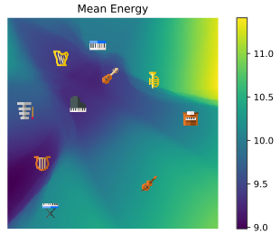

<!-- Intro -->

During the summer of 2018, I have worked as a research scientist intern at Spotify. I have been to the NYC headquarter for one of the [Monthly Music Hackathon](http://monthlymusichackathon.org/post/169872330642/science-of-music-hackathon-the-monthly-music) events, but to partake in one of [the world's best internship programs](https://www.nationalinternday.com/top100-2018/) was such a tremendous experience. In this post, I'd like to share a summary of my internship project on music synthesis, that I am finalizing here at Spotify.

## Timbre and the Musician's Brain

Since I have started at [MARL](https://steinhardt.nyu.edu/marl/) in 2011, my primary interest was on enabling computers to write down the score of music when an audio file is given, just like experienced musicians. This task is called [automatic music transcription](https://en.wikipedia.org/wiki/Transcription_%28music%29), and and achieving human-level accuracy on this task remains an unsolved problem.

I believe that the key component that will enable the human-level music transcription will be machine understanding of [timbre](https://en.wikipedia.org/wiki/Timbre). Timbre, often called as color of a tone, is a fascinating but not fully well-defined concept. For musicians, timbre is what characterizes an instrument, and it constitutes a source of musical inspiration and creativity. In literature, it is often 'negatively' defined: the quality of sound that allows distinguishing notes of the same pitch, loudness, and duration. Unlike the other three qualities, timbre cannot be represented with a scalar value that is closely related to a physical quanitity like frequency, sound pressure, and time, so computational modeling of timbre typically involves an array of numbers, like the [Mel-frequency cepstral coefficients (MFCCs)](https://en.wikipedia.org/wiki/Mel-frequency_cepstrum) or [learned embedding vectors](https://ieeexplore.ieee.org/abstract/document/6147663/) obtained from the penultimate layer of a deep instrument classification model.

Meanwhile, the 'negative' definition motivates another way of modeling timbre: given the pitch, loudness, and duration information, the only remaining thing to be determined to precisely *synthesize* music is the information on timbre. This can be considered as the 'reverse' of typical [music information retrieval (MIR)](https://en.wikipedia.org/wiki/Music_information_retrieval) systems which take audio as the input and predict the semantic information about the music. The synthesis approach is more in line with the negative defintion because it can model the information that is not specified by pitch, loudness, or duration; using generative models to formulate the unspecified portion of information is explored in the context of [disentanglement](https://sites.google.com/view/disentanglenips2017).

Furthermore, having a solid architecture of music synthesis model allows to build an autoencoder by concatenating the discriminative portion which can transcribe notes and the generative portion which can synthesize the same audio back from the transcribed information:

 Autoencoder architecture composed of music transcriber and synthesizer

The autoencoding task above is essentially what a musician's brain is capable of; they appreciate the sound of music in the form of the mental representation consisting of individual notes and their combinations, thanks to the automatic conversion between the physical soundwave and the mental representation happening under the hood.

In contrast to the extensive record of machine learning research for the encoder part, fewer resources are available to implement the decoder part, as most of the studies on music synthesis have been geared toward artistic applications and the engineering for achieving it. This is what motivated the internship project: a predictable music synthesis model with separate knobs for controlling the timbre and the other qualities of music.

## Sample-Level Audio Synthesis using WaveNet

Typical audio files contain 44,100 audio samples per channel per second, and even if we simplify that to a single-channel 16kHz audio (at the cost of degraded audio quality), predicting 16,000 numbers from scratch just using a few knobs is still a very challenging task. To compare, early generative models for images were focused on producing 784 (=28x28) pixels of convincing quality; it took a few more years and hundreds of genius researchers to have a generative model that can produce high-resolution images like 256x256.

In 2016, DeepMind created WaveNet, a generative model for audio that works sample-by-sample, yet creates a very convincing quality of human speech. The original formulation used [µ-law quantized](https://en.wikipedia.org/wiki/%CE%9C-law_algorithm) 256-class categorical predictions with linguistic features for conditioning, and the subsequent improvements in [Parallel WaveNet](https://deepmind.com/blog/high-fidelity-speech-synthesis-wavenet/) enabled continuous-amplitude samples using mixture of [logistic](https://en.wikipedia.org/wiki/Logistic_distribution) (MoL) distributions and fast inference using [inverse autoregressive flows](https://arxiv.org/abs/1606.04934). Google's [Tacotron](https://ai.googleblog.com/2017/12/tacotron-2-generating-human-like-speech.html) and Baidu's [Deep Voice](http://research.baidu.com/Blog/index-view?id=91) models are able to predict Mel spectrograms from text, and the Mel spectrograms can be fed to a WaveNet vocoder to generate audio; together, a fully neural text-to-speech engine is formed. Very recently, [ClariNet](https://clarinet-demo.github.io) showed that it is possible to train Parallel WaveNet only using a single Gaussian distribution and IAF, moreover in a fully end-to-end manner in which the text-to-speech model is trained as a whole, rather than appending a separately trained WaveNet vocoder.

 Dilated convolutions of WaveNet; animation adopted from [the DeepMind blog](https://deepmind.com/blog/wavenet-generative-model-raw-audio/)

So far the primary application for WaveNet has been speech synthesis, but a few notable applications exists in the music domain as well. These include [NSynth](https://magenta.tensorflow.org/nsynth) from the Magenta project and [Universal Music Translation](http://ytaigman.github.io/musicnet) from Facebook AI Research. NSynth proposed an autoencoder architecture which separately encodes pitch and timbral features, and the Universal Music Translation network uses a denoising autoencoder architecture that can extract and translate between musical styles while preserving the melody. The example audio samples are, while intriguing, not as natural and realistic sounding as the speech examples, which are almost indistinguishable from the real speech; this suggests that there is still a lot to be explored and improved in the music-oriented WaveNet models.

## The Mel2Mel Model

The neural network below, dubbed Mel2Mel, concerns the task of synthesizing music corresponding to given MIDI score and some information on the timbre, represented as an embedding vector.

 The Mel2Mel model takes a MIDI score and timbre embedding to produce corresponding music

In this architecture, the MIDI score is converted to a piano roll representation, which contains the onset and frame timings for each of the 88 piano keys, comprising 176 dimensions in total. This idea is inspired by the [Onsets and Frames](https://magenta.tensorflow.org/onsets-frames) model which greatly helped improve the transcription performance compared to using frame information only. This representation goes through a linear 1x1 convolution layer, which is basically a time-distributed fully connected layer, followed by a FiLM layer to be explained shortly, which takes the timbre embedding vector and transforms the features accordingly. After a bidirectional LSTM layer and another FiLM layer for timbre conditioning, another linear 1x1 convolution layer produces the Mel spectrogram prediction. Note that the nonlinearities are only in the LSTM, and there is no time-domain convolutions up to this point. The resulting Mel spectrogram is then fed to a WaveNet vocoder to produce the music.

#### Timbre conditioning using FiLM layers

There are a plenty of different architectural choices for allowing the neural network to take side information, for example a timbre embedding vector, and the [Feature-wise Linear Modulation (FiLM)](https://distill.pub/2018/feature-wise-transformations/) layer is a simple and very effective way of implementing the timbre conditioning of the music synthesis model. 

The basic idea of FiLM is to apply an affine transformation of the features in an intermediate layer of the network, defined using the multiplicative parameter $\gamma$ and the additive parameter $\beta$, modeled by neural networks $f$ and $h$:

\[
    \gamma _ {i, c} = f _ c ( \mathbf{x} _ i ), ~~~~ \beta _ {i, c} = h _ c ( \mathbf{x} _ i ).
\]

In our model, both $f$ and $h$ are defined as a linear layer, i.e. a matrix multiplication with bias. The affine transformation, or *FiLM*-ing, is then applied as simple, feature-wise operations:

\[
    \mathrm{FiLM}(\mathbf{F} _ {i,c} | \gamma _ {i, c}, \beta _ {i, c}) = \gamma _ {i,c} \mathbf{F} _ {i, c} + \beta _ {i, c}.
\]

#### Dataset

The MIDI files used to train this model is collected from [www.piano-midi.de](http://www.piano-midi.de), where the MIDI files used for creating the [MAPS Database](http://www.tsi.telecom-paristech.fr/aao/en/2010/07/08/maps-database-a-piano-database-for-multipitch-estimation-and-automatic-transcription-of-music/) were collected. 334 piano tracks are synthesized using the soundfont included in [MuseScore](https://musescore.org/en), for each of the 10 selected general MIDI instruments: Grand Piano, Electric Piano, Vibraphone, Church Organ, Acoustic Guitar, Pizzicato Strings, Orchestral Harp, String Ensemble,Trumpet, and Synth Lead.

#### Model Details

The sampling rate of 16 kHz and µ-law encoding with 256 quantization levels were used for all audio as in the original WaveNet paper. The predicted Mel spectrograms are defined using 80 triangular filters distributed evenly between zero and the Nyquist frequency in the Mel scale. The step size of 128 samples is used, which translates to 8 milliseconds. The dimension of the timbre embedding space is variable, while the web demo uses 2-dimensional embedding. 256 channels are used in all hidden layers unless specified otherwise. For the Mel2Mel model, Adam optimizer with the initial learning rate of 0.002 is used, and the learning rate is halved every 40,000 iterations. Each iteration takes a mini-batch of 128 sequences of length 65536. Three different loss functions are used and compared; for linear-scale Mel spectrograms $S_{\mathrm{true}}$ and $S_{\mathrm{pred}}$:

<table style="width: 500px; margin: auto;" border cellspaing="0" cellpadding="0"><thead><tr><th>Name</th> <th>Loss Function</th></tr></thead><tbody><tr><td>abs MSE</td><td>$\mathbb{E} \left ( S_{\mathrm{true}} - S_{\mathrm{pred}} \right )^2$</td></tr><tr><td>log-abs MSE</td><td>$\mathbb{E} \left ( \log S_{\mathrm{true}} - \log S_{\mathrm{pred}} \right )^2$</td></tr><tr><td>tanh-log-abs MSE</td><td>$\mathbb{E} \left ( \tanh \frac{1}{4} \log S_{\mathrm{true}} - \tanh \frac{1}{4} \log S_{\mathrm{pred}} \right )^2$</td></tr></tbody></table>

All logarithms above are natural, and the spectrogram magnitudes are clipped at -100 dB. Prepending $\tanh$ gives an effect where the errors in the low-energy ranges are penalized less than the errors in the time-frequency bin with energy close to 0 dB.

For the WaveNet vocoder, we used [nv-wavenet](https://devblogs.nvidia.com/nv-wavenet-gpu-speech-synthesis/), an implementation provided by NVIDIA which computes the inference for the whole sequence in a single call to its custum CUDA kernel. This implementation imposes the recurrent channels to be 64 and the skip channels to be 256 at maximum, because of the limitation in the GPU memory capacity. Although nv-wavenet is autoregressive and slower than Parallel WaveNet, it allows faster-than-real-time synthesis without separately training a student WaveNet through inverse autoregressive flows (IAF). 

20-layer WaveNet was trained with the maximum dilation of 512, and the Mel spectrogram input is upsampled using two transposed convolution layers of window sizes 16 and 32 with strides of 8 and 16, respectively. Adam optimizer of the initial learning rate of 0.001 is used, and the learning rate is halved every 100,000 iterations. Each iteration takes a mini-batch of 4 sequences of length 16384. The network is trained for one million iterations.

## Results

- Generated Mel Spectrograms

<video src="Neural-Music-Synthesis/video.mp4" controls loop></video>

- Reconstruction Accuracy w.r.t. Loss functions and Instruments

- Embedding Space Visualization

- MOS

<table style="width: 700px; margin: auto;" border cellspaing="0" cellpadding="0"><thead><tr><th>Condition</th> <th>Scores $\pm$ SEM</th><th>Condition</th> <th>Scores $\pm$ SEM</th></tr></thead><tbody><tr><td>Original</td><td>$4.316 \pm 0.041 $</td><td>tanh-log-abs MSE</td><td>$3.183 \pm 0.056 $</td></tr><tr><td>mu-law Only</td><td>$3.879 \pm 0.051 $</td><td>log-abs MSE</td><td>$3.011 \pm 0.058 $</td></tr><tr><td>Ground-Truth Mel</td><td>$3.378 \pm 0.052 $</td><td>abs MSE</td><td>$ 2.757 \pm 0.058 $</td></tr></tbody></table>

<!-- Alternative representations (120 mel, 160 mel, 96 cqt) -->

- TODO: Ablation Study

- TODO: 100-instrument visualization (4D t-SNE)

<!--
  - 88 from rachel
  - 10 from original
  - 2 from ???
-->

## Conclusion and Future Work

We showed that it is possible to build a music synthesis model by combining a recurrent neural network and FiLM conditioning layers, followed by a WaveNet decoder. It successfully learns to synthesize musical notes according to the given MIDI score and timbre conditioning. In addition, it is possible to interpolate between instruments in the embedding space, giving the ability of timbre morphing.

The number of residual channels and the number of layers in the current WaveNet model is limited due to the memory requirements of the nv-wavenet implementation, and the degradation from µ-law quantization was also apparent in the experiments. These limitations can be overcome by implementing Parallel WaveNet, which does not require special CUDA kernels for fast synthesis and uses continuous probability distribution for generation, thereby avoiding the quantization noise.

It is intriguing that the WaveNet vocoder can synthesize polyphonic music from Mel spectrograms having only 80 frequency bins, which are not even aligned to the tuning of the audio files. While more information available from the increased bins help synthesizing more accurate audio, predicting the higher-dimensional representation becomes more difficult and inaccurate, making 80-bin Mel spectrogram a sweet spot for use with WaveNet. (*TODO: support this claim with synthesis quality using different n_mel; theoretical reference*) Introducing an adversarial loss function can be a viable direction to predicting accurate and realistic Mel spectrograms for conditioning WaveNet.

Our music synthesis model draws audio samples conditioned on timbre embedding and the symbolic music in the form of piano rolls. An interesting extension to this model would be obtaining the inverse; predicting the distribution of timbre embeddings from audio would be useful for instrument recognition and provide a tool for music production where a software instrument can be built automatically from a few audio examples. The other part of the inversion, predicting the piano roll from audio, is essentially automatic music transcription which is a much more formidable task, and the aforementioned autoencoder formulation would be an interesting direction to solve transcription and synthesis simultaneously.
