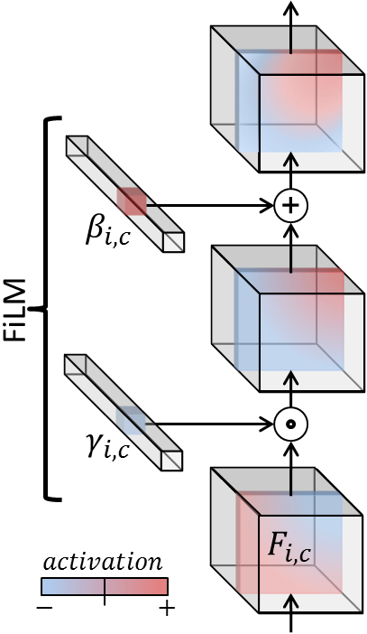

<!-- Intro -->

During the summer of 2018, I have worked as a research scientist intern at Spotify. I have been to the NYC headquarter for one of the [Monthly Music Hackathon](http://monthlymusichackathon.org/post/169872330642/science-of-music-hackathon-the-monthly-music) events, but to partake in one of [the world's best internship programs](https://www.nationalinternday.com/top100-2018/) was such a tremendous experience. In this post, I'd like to share a summary of my internship project on music synthesis, that I am finalizing here at Spotify.

## Timbre and the Musician's Brain

Since I have started at [MARL](https://steinhardt.nyu.edu/marl/) in 2011, my primary interest was on enabling computers to write down the score of music when an audio file is given, just like experienced musicians. This task is called [automatic music transcription](https://en.wikipedia.org/wiki/Transcription_%28music%29), and and achieving human-level accuracy on this task remains an unsolved problem.

I believe that the key component that will enable the human-level music transcription will be machine understanding of [timbre](https://en.wikipedia.org/wiki/Timbre). Timbre, often called as color of a tone, is a fascinating but not fully well-defined concept. For musicians, timbre is what characterizes an instrument, and it constitutes a source of musical inspiration and creativity. In literature, it is often 'negatively' defined: the quality of sound that allows distinguishing notes of the same pitch, loudness, and duration. Unlike the other three qualities, timbre cannot be represented with a scalar value that is closely related to a physical quanitity like frequency, sound pressure, and time, so computational modeling of timbre typically involves an array of numbers, like the [Mel-frequency cepstral coefficients (MFCCs)](https://en.wikipedia.org/wiki/Mel-frequency_cepstrum) or [learned embedding vectors](https://ieeexplore.ieee.org/abstract/document/6147663/) obtained from the penultimate layer of a deep instrument classification model.

Meanwhile, the 'negative' definition motivates another way of modeling timbre: given the pitch, loudness, and duration information, the only remaining thing to be determined to precisely *synthesize* music is the information on timbre. This can be considered as the 'reverse' of typical [music information retrieval (MIR)](https://en.wikipedia.org/wiki/Music_information_retrieval) systems which take audio as the input and predict the semantic information about the music. The synthesis approach is more in line with the negative defintion because it can model the information that is not specified by pitch, loudness, or duration; using generative models to formulate the unspecified portion of information is explored in the context of [disentanglement](https://sites.google.com/view/disentanglenips2017).

Furthermore, having a solid architecture of music synthesis model allows to build an autoencoder by concatenating the discriminative portion which can transcribe notes and the generative portion which can synthesize the same audio back from the transcribed information:



The autoencoding task above is essentially what a musician's brain is capable of; they appreciate the sound of music in the form of the mental representation consisting of individual notes and their combinations, thanks to the automatic conversion between the physical soundwave and the mental representation happening under the hood.

In contrast to the extensive record of machine learning research for the encoder part, fewer resources are available to implement the decoder part, as most of the studies on music synthesis have been geared toward artistic applications and the engineering for achieving it. This is what motivated my internship project: a predictable music synthesis model with separate knobs for controlling the timbre and the other qualities of music.

## Sample-Level Audio Synthesis using WaveNet

- Audio Synthesis: WaveNet
  - Original WaveNet, Parallel WaveNet
  - Tacotron and Deep Voice series
  - NSynth, Universal Music Translation

## The Mel2Mel Model

- The Overall Architecture

- The Onsets and Frames Representation
- FiLM Layer for Timbre Conditioning

\[
    \gamma _ {i, c} = f _ c ( \mathbf{x} _ i ), ~~~~ \beta _ {i, c} = h _ c ( \mathbf{x} _ i ).
\]

\[
    \mathrm{FiLM}(\mathbf{F} _ {i,c} | \gamma _ {i, c}, \beta _ {i, c}) = \gamma _ {i,c} \mathbf{F} _ {i, c} + \beta _ {i, c}.
\]

## Results

- Generated Mel Spectrograms

<video src="Neural-Music-Synthesis/video.mp4" controls loop></video>

- Reconstruction Accuracy w.r.t. Loss functions and Instruments

- Embedding Space Visualization

- MOS

<table border cellspaing="0" cellpadding="0"><thead><tr><th>Condition</th> <th>Scores $\pm$ SEM</th><th>Condition</th> <th>Scores $\pm$ SEM</th></tr></thead><tbody><tr><td>Original</td><td>$4.316 \pm 0.041 $</td><td>tanh-log-abs MSE</td><td>$3.183 \pm 0.056 $</td></tr><tr><td>mu-law Only</td><td>$3.879 \pm 0.051 $</td><td>log-abs MSE</td><td>$3.011 \pm 0.058 $</td></tr><tr><td>Ground-Truth Mel</td><td>$3.378 \pm 0.052 $</td><td>abs MSE</td><td>$ 2.757 \pm 0.058 $</td></tr></tbody></table>

- 100-instrument visualization (4D t-SNE)

## Conclusions
- Built a model which combines RNN and WaveNet to synthesize polyphonic music from MIDI score and instrument information
- We can interpolate between instruments 

## Up Next

- Learning about the inverse of the network
- More than just deterministic: generative modeling
